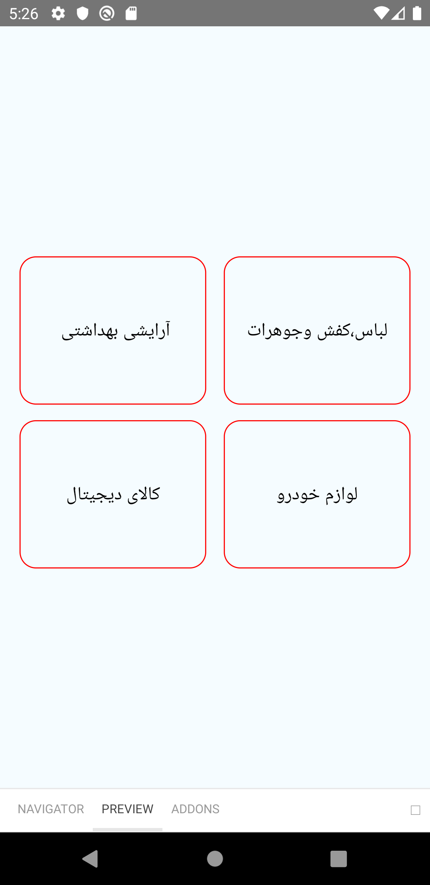
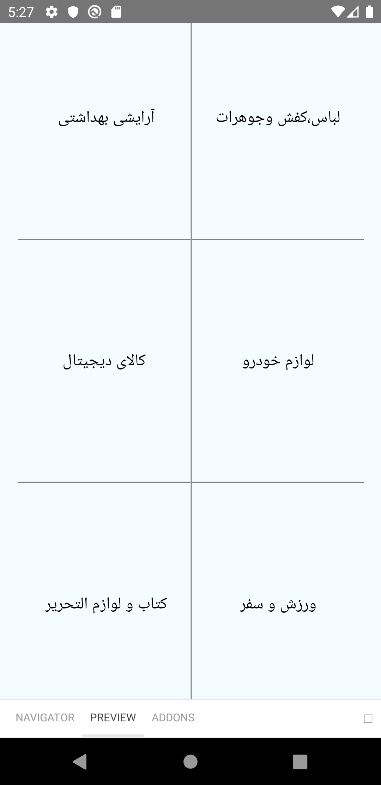

# GridList

### Usage

##### GridList without styleItemModule(Custom style for each item)

```js
import {GridList} from 'design-system-react-native';
<GridList
  countItems={4}
  styleLayout={styles.layout}
  styleRow={{marginHorizontal: 4}}
  column={2}
  data={data}
  ItemNode={({item, index}) => (
    <View style={styles.cardList}>
      <Text style={styles.text}>{item.title}</Text>
    </View>
  )}
/>;
```



or

##### GridList with styleItemModule(Custom style for each item)

```js
const layoutBorder = ({column, data, index, countItems}) => {
  const colorBorder = 'grey';
  const widthBorder = 1;
  let lenghtData = data.length;
  if (countItems) {
    if (column === 3 && countItems === 9) {
      if (index === 5) {
        return {
          borderTopColor: colorBorder,
          borderBottomColor: colorBorder,
          borderLeftColor: colorBorder,
          borderBottomWidth: widthBorder,
          borderLeftWidth: widthBorder,
          borderTopWidth: widthBorder,
        };
      }
      if (index === 6) {
        return {borderRightColor: colorBorder, borderRightWidth: widthBorder};
      }
      if (index === 8) {
        return {borderLeftColor: colorBorder, borderLeftWidth: widthBorder};
      }
      if (index === 1 || index === 4) {
        return {borderBottomColor: colorBorder, borderBottomWidth: widthBorder};
      }
      if (index === 2) {
        return {
          borderBottomColor: colorBorder,
          borderBottomWidth: widthBorder,
          borderLeftColor: colorBorder,
          borderLeftWidth: widthBorder,
        };
      }
      if (
        index !== 4 &&
        index !== 1 &&
        index !== 2 &&
        index !== 5 &&
        index !== 6 &&
        index !== 7 &&
        index !== 8
      ) {
        return {
          borderBottomColor: colorBorder,
          borderRightColor: colorBorder,
          borderBottomWidth: widthBorder,
          borderRightWidth: widthBorder,
        };
      }
    } else if (column === 2 && countItems === 4) {
      if (index === 0) {
        return {borderBottomColor: colorBorder, borderBottomWidth: widthBorder};
      }
      if (index === 1) {
        return {
          borderLeftColor: colorBorder,
          borderBottomColor: colorBorder,
          borderLeftWidth: widthBorder,
          borderBottomWidth: widthBorder,
        };
      }
      if (index === 3) {
        return {borderLeftColor: colorBorder, borderLeftWidth: widthBorder};
      }
    } else if (column === 2 && countItems === 6) {
      if (index === 0 || index === 2) {
        return {borderBottomColor: colorBorder, borderBottomWidth: widthBorder};
      }
      if (index === 1 || index === 3) {
        return {
          borderLeftColor: colorBorder,
          borderBottomColor: colorBorder,
          borderLeftWidth: widthBorder,
          borderBottomWidth: widthBorder,
        };
      }
      if (index === 5) {
        return {borderLeftColor: colorBorder, borderLeftWidth: widthBorder};
      }
    }
  }
};

export default layoutBorder;
```

```js
import {GridList} from 'design-system-react-native';
<GridList
  countItems={6}
  styleRow={{height: 250}}
  styleLayout={{marginLeft: 18}}
  styleItemModule={layoutBorder}
  column={2}
  data={data}
  ItemNode={({item, index}) => (
    <View style={{alignItems: 'center', justifyContent: 'center'}}>
      <Text style={styles.text}>{item.title}</Text>
    </View>
  )}
/>;
```



| prop            | typeProp                                      | default                                                                  | description                                                                                                                                                                                                                               |
| --------------- | --------------------------------------------- | ------------------------------------------------------------------------ | ----------------------------------------------------------------------------------------------------------------------------------------------------------------------------------------------------------------------------------------- |
| column          | number                                        |                                                                          | The field is mandatory, The number of columns for the GridList                                                                                                                                                                            |
| data            | Array of objects                              |                                                                          | The field is mandatory, We map the data and show it in the list                                                                                                                                                                           |
| styleRow        | object                                        | {alignItems: "stretch",justifyContent: 'center',flexDirection: 'column'} | Style for each table row                                                                                                                                                                                                                  |
| styleLayout     | object                                        |                                                                          | Style for the GridList                                                                                                                                                                                                                    |
| countItems      | number                                        |                                                                          | The field is mandatory, If my data has up to n values, with this prop we can say how many items I want to show, for example, if the value is 6 and the number of columns is 3, it will be a table with two rows and three columns.        |
| ItemNode        | A component whose return value is JSX.Element |                                                                          | ui We give each house of the table as a component to this prop. for example ,`ItemNode={({ item, index }) => (<View > <Text >{item.title}</Text></View>)} `                                                                               |
| styleItemModule | A function that returns an object             |                                                                          | When we want to give a different style to each house in the table, we use this prop, which has access to **index, column, data, countItems** in this function, which returns an object for us and is considered as a style for that house |
